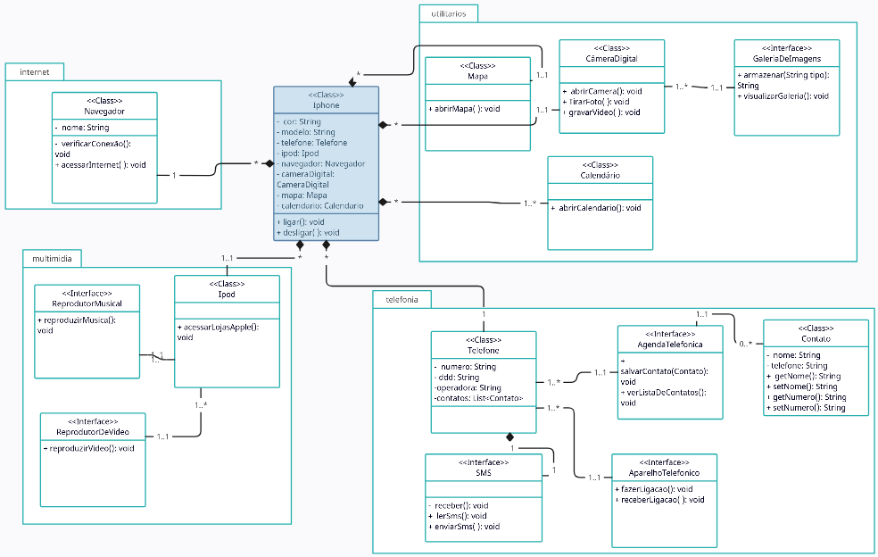

## Desafio proposto: Diagramação de classes Iphone

Esse repositório foi criado com o intuito de criar um diagrama UML para por em prática os conhecimentos adquiridos de análise de negócio, requisitos e programação orientada a objeto durante o Curso Java Back-end.
Abaixo deixo o driagrama criado para esse desafio:

## Folder Structure

The workspace contains two folders by default, where:

- `src`: the folder to maintain sources
- `lib`: the folder to maintain dependencies

Meanwhile, the compiled output files will be generated in the `bin` folder by default.

> If you want to customize the folder structure, open `.vscode/settings.json` and update the related settings there.

## Dependency Management

The `JAVA PROJECTS` view allows you to manage your dependencies. More details can be found [here](https://github.com/microsoft/vscode-java-dependency#manage-dependencies).
